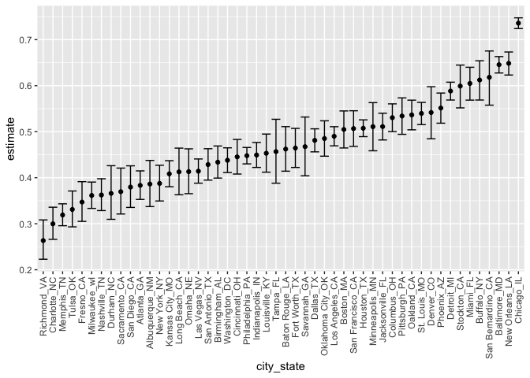

p8105\_hw5\_ml4424.Rmd
================
Maggie Li (ml4424)
11/16/2020

## Problem 1

``` r
library(tidyverse)
```

    ## ── Attaching packages ─────────────────────────────────────── tidyverse 1.3.0 ──

    ## ✓ ggplot2 3.3.2     ✓ purrr   0.3.4
    ## ✓ tibble  3.0.3     ✓ dplyr   1.0.2
    ## ✓ tidyr   1.1.2     ✓ stringr 1.4.0
    ## ✓ readr   1.4.0     ✓ forcats 0.5.0

    ## ── Conflicts ────────────────────────────────────────── tidyverse_conflicts() ──
    ## x dplyr::filter() masks stats::filter()
    ## x dplyr::lag()    masks stats::lag()

``` r
library(utils)
library(ggplot2)

homicides_dta = read_csv("p1_data/homicide-data.csv")
```

    ## 
    ## ── Column specification ────────────────────────────────────────────────────────
    ## cols(
    ##   uid = col_character(),
    ##   reported_date = col_double(),
    ##   victim_last = col_character(),
    ##   victim_first = col_character(),
    ##   victim_race = col_character(),
    ##   victim_age = col_character(),
    ##   victim_sex = col_character(),
    ##   city = col_character(),
    ##   state = col_character(),
    ##   lat = col_double(),
    ##   lon = col_double(),
    ##   disposition = col_character()
    ## )

``` r
homicides_dta
```

    ## # A tibble: 52,179 x 12
    ##    uid   reported_date victim_last victim_first victim_race victim_age
    ##    <chr>         <dbl> <chr>       <chr>        <chr>       <chr>     
    ##  1 Alb-…      20100504 GARCIA      JUAN         Hispanic    78        
    ##  2 Alb-…      20100216 MONTOYA     CAMERON      Hispanic    17        
    ##  3 Alb-…      20100601 SATTERFIELD VIVIANA      White       15        
    ##  4 Alb-…      20100101 MENDIOLA    CARLOS       Hispanic    32        
    ##  5 Alb-…      20100102 MULA        VIVIAN       White       72        
    ##  6 Alb-…      20100126 BOOK        GERALDINE    White       91        
    ##  7 Alb-…      20100127 MALDONADO   DAVID        Hispanic    52        
    ##  8 Alb-…      20100127 MALDONADO   CONNIE       Hispanic    52        
    ##  9 Alb-…      20100130 MARTIN-LEY… GUSTAVO      White       56        
    ## 10 Alb-…      20100210 HERRERA     ISRAEL       Hispanic    43        
    ## # … with 52,169 more rows, and 6 more variables: victim_sex <chr>, city <chr>,
    ## #   state <chr>, lat <dbl>, lon <dbl>, disposition <chr>

*Description*: The data are organized with a unique identifier, the date
of homicide (Y-M-D), victim’s full name, age, race, sex, the city and
state in which the homicide occurred, the latitude and longitude of the
homicide, and the disposition (status) of the homicide case.

``` r
homicides_dta = homicides_dta %>% 
  unite("city_state", sep = "_", city:state) %>%
  mutate(solved_status = case_when(disposition == "Closed by arrest" ~ "solved",
                                   disposition ==  "Closed without arrest" ~ "unsolved",
                                   disposition == "Open/No arrest" ~ "unsolved")) %>% 
  select(city_state, solved_status) %>% 
  filter(city_state != "Tulsa_AL")

# View distribution of total and unsolved in all cities
agg_hom_df = 
  homicides_dta %>% 
  group_by(city_state) %>%
  summarize(hom_total = n(),
            hom_unsolved = sum(solved_status == "unsolved"))
```

    ## `summarise()` ungrouping output (override with `.groups` argument)

``` r
prop.test(agg_hom_df %>% filter(city_state == "Baltimore_MD") %>% pull(hom_unsolved),
          agg_hom_df %>% filter(city_state == "Baltimore_MD") %>% pull(hom_total)) %>% 
  broom::tidy()
```

    ## # A tibble: 1 x 8
    ##   estimate statistic  p.value parameter conf.low conf.high method    alternative
    ##      <dbl>     <dbl>    <dbl>     <int>    <dbl>     <dbl> <chr>     <chr>      
    ## 1    0.646      239. 6.46e-54         1    0.628     0.663 1-sample… two.sided

``` r
prop.test(agg_hom_df %>% pull(hom_unsolved),
          agg_hom_df %>% pull(hom_total)) %>% 
  broom::tidy()
```

    ## # A tibble: 1 x 55
    ##   estimate1 estimate2 estimate3 estimate4 estimate5 estimate6 estimate7
    ##       <dbl>     <dbl>     <dbl>     <dbl>     <dbl>     <dbl>     <dbl>
    ## 1     0.386     0.383     0.646     0.462     0.434     0.505     0.612
    ## # … with 48 more variables: estimate8 <dbl>, estimate9 <dbl>, estimate10 <dbl>,
    ## #   estimate11 <dbl>, estimate12 <dbl>, estimate13 <dbl>, estimate14 <dbl>,
    ## #   estimate15 <dbl>, estimate16 <dbl>, estimate17 <dbl>, estimate18 <dbl>,
    ## #   estimate19 <dbl>, estimate20 <dbl>, estimate21 <dbl>, estimate22 <dbl>,
    ## #   estimate23 <dbl>, estimate24 <dbl>, estimate25 <dbl>, estimate26 <dbl>,
    ## #   estimate27 <dbl>, estimate28 <dbl>, estimate29 <dbl>, estimate30 <dbl>,
    ## #   estimate31 <dbl>, estimate32 <dbl>, estimate33 <dbl>, estimate34 <dbl>,
    ## #   estimate35 <dbl>, estimate36 <dbl>, estimate37 <dbl>, estimate38 <dbl>,
    ## #   estimate39 <dbl>, estimate40 <dbl>, estimate41 <dbl>, estimate42 <dbl>,
    ## #   estimate43 <dbl>, estimate44 <dbl>, estimate45 <dbl>, estimate46 <dbl>,
    ## #   estimate47 <dbl>, estimate48 <dbl>, estimate49 <dbl>, estimate50 <dbl>,
    ## #   statistic <dbl>, p.value <dbl>, parameter <dbl>, method <chr>,
    ## #   alternative <chr>

``` r
# note: map is for loop alternative
results_df = agg_hom_df %>% 
  mutate(
    prop_tests = map2(.x = hom_unsolved, .y = hom_total, ~prop.test(x = .x, n = .y)), # looping first arg
    tidy_tests = map(.x = prop_tests, ~broom::tidy(.x))) %>%  # looping second arg; tibble within tibble in nested format
  select(-prop_tests) %>% 
  unnest(tidy_tests) %>% #view unnested version of tidy_test tibble
  select(city_state, estimate, conf.low, conf.high)
```

``` r
results_df %>% 
  mutate(city_state = fct_reorder(city_state, estimate)) %>% 
  ggplot(aes(x = city_state, y = estimate)) +
  geom_point() +
  geom_errorbar(aes(ymin = conf.low, ymax = conf.high)) +
  theme(axis.text.x = element_text(angle = 90, vjust = 0.5, hjust = 1))
```

<!-- -->

## Problem 2

``` r
study_df = tibble(path = list.files("p2_data")) %>% 
  mutate(path = str_c("p2_data/", path), # need full relative path name
         data = map(.x = path, ~read_csv(.x))) %>% 
  unnest(data) # unnest data for readability
```

    ## 
    ## ── Column specification ────────────────────────────────────────────────────────
    ## cols(
    ##   week_1 = col_double(),
    ##   week_2 = col_double(),
    ##   week_3 = col_double(),
    ##   week_4 = col_double(),
    ##   week_5 = col_double(),
    ##   week_6 = col_double(),
    ##   week_7 = col_double(),
    ##   week_8 = col_double()
    ## )
    ## 
    ## 
    ## ── Column specification ────────────────────────────────────────────────────────
    ## cols(
    ##   week_1 = col_double(),
    ##   week_2 = col_double(),
    ##   week_3 = col_double(),
    ##   week_4 = col_double(),
    ##   week_5 = col_double(),
    ##   week_6 = col_double(),
    ##   week_7 = col_double(),
    ##   week_8 = col_double()
    ## )
    ## 
    ## 
    ## ── Column specification ────────────────────────────────────────────────────────
    ## cols(
    ##   week_1 = col_double(),
    ##   week_2 = col_double(),
    ##   week_3 = col_double(),
    ##   week_4 = col_double(),
    ##   week_5 = col_double(),
    ##   week_6 = col_double(),
    ##   week_7 = col_double(),
    ##   week_8 = col_double()
    ## )
    ## 
    ## 
    ## ── Column specification ────────────────────────────────────────────────────────
    ## cols(
    ##   week_1 = col_double(),
    ##   week_2 = col_double(),
    ##   week_3 = col_double(),
    ##   week_4 = col_double(),
    ##   week_5 = col_double(),
    ##   week_6 = col_double(),
    ##   week_7 = col_double(),
    ##   week_8 = col_double()
    ## )
    ## 
    ## 
    ## ── Column specification ────────────────────────────────────────────────────────
    ## cols(
    ##   week_1 = col_double(),
    ##   week_2 = col_double(),
    ##   week_3 = col_double(),
    ##   week_4 = col_double(),
    ##   week_5 = col_double(),
    ##   week_6 = col_double(),
    ##   week_7 = col_double(),
    ##   week_8 = col_double()
    ## )
    ## 
    ## 
    ## ── Column specification ────────────────────────────────────────────────────────
    ## cols(
    ##   week_1 = col_double(),
    ##   week_2 = col_double(),
    ##   week_3 = col_double(),
    ##   week_4 = col_double(),
    ##   week_5 = col_double(),
    ##   week_6 = col_double(),
    ##   week_7 = col_double(),
    ##   week_8 = col_double()
    ## )
    ## 
    ## 
    ## ── Column specification ────────────────────────────────────────────────────────
    ## cols(
    ##   week_1 = col_double(),
    ##   week_2 = col_double(),
    ##   week_3 = col_double(),
    ##   week_4 = col_double(),
    ##   week_5 = col_double(),
    ##   week_6 = col_double(),
    ##   week_7 = col_double(),
    ##   week_8 = col_double()
    ## )
    ## 
    ## 
    ## ── Column specification ────────────────────────────────────────────────────────
    ## cols(
    ##   week_1 = col_double(),
    ##   week_2 = col_double(),
    ##   week_3 = col_double(),
    ##   week_4 = col_double(),
    ##   week_5 = col_double(),
    ##   week_6 = col_double(),
    ##   week_7 = col_double(),
    ##   week_8 = col_double()
    ## )
    ## 
    ## 
    ## ── Column specification ────────────────────────────────────────────────────────
    ## cols(
    ##   week_1 = col_double(),
    ##   week_2 = col_double(),
    ##   week_3 = col_double(),
    ##   week_4 = col_double(),
    ##   week_5 = col_double(),
    ##   week_6 = col_double(),
    ##   week_7 = col_double(),
    ##   week_8 = col_double()
    ## )
    ## 
    ## 
    ## ── Column specification ────────────────────────────────────────────────────────
    ## cols(
    ##   week_1 = col_double(),
    ##   week_2 = col_double(),
    ##   week_3 = col_double(),
    ##   week_4 = col_double(),
    ##   week_5 = col_double(),
    ##   week_6 = col_double(),
    ##   week_7 = col_double(),
    ##   week_8 = col_double()
    ## )
    ## 
    ## 
    ## ── Column specification ────────────────────────────────────────────────────────
    ## cols(
    ##   week_1 = col_double(),
    ##   week_2 = col_double(),
    ##   week_3 = col_double(),
    ##   week_4 = col_double(),
    ##   week_5 = col_double(),
    ##   week_6 = col_double(),
    ##   week_7 = col_double(),
    ##   week_8 = col_double()
    ## )
    ## 
    ## 
    ## ── Column specification ────────────────────────────────────────────────────────
    ## cols(
    ##   week_1 = col_double(),
    ##   week_2 = col_double(),
    ##   week_3 = col_double(),
    ##   week_4 = col_double(),
    ##   week_5 = col_double(),
    ##   week_6 = col_double(),
    ##   week_7 = col_double(),
    ##   week_8 = col_double()
    ## )
    ## 
    ## 
    ## ── Column specification ────────────────────────────────────────────────────────
    ## cols(
    ##   week_1 = col_double(),
    ##   week_2 = col_double(),
    ##   week_3 = col_double(),
    ##   week_4 = col_double(),
    ##   week_5 = col_double(),
    ##   week_6 = col_double(),
    ##   week_7 = col_double(),
    ##   week_8 = col_double()
    ## )
    ## 
    ## 
    ## ── Column specification ────────────────────────────────────────────────────────
    ## cols(
    ##   week_1 = col_double(),
    ##   week_2 = col_double(),
    ##   week_3 = col_double(),
    ##   week_4 = col_double(),
    ##   week_5 = col_double(),
    ##   week_6 = col_double(),
    ##   week_7 = col_double(),
    ##   week_8 = col_double()
    ## )
    ## 
    ## 
    ## ── Column specification ────────────────────────────────────────────────────────
    ## cols(
    ##   week_1 = col_double(),
    ##   week_2 = col_double(),
    ##   week_3 = col_double(),
    ##   week_4 = col_double(),
    ##   week_5 = col_double(),
    ##   week_6 = col_double(),
    ##   week_7 = col_double(),
    ##   week_8 = col_double()
    ## )
    ## 
    ## 
    ## ── Column specification ────────────────────────────────────────────────────────
    ## cols(
    ##   week_1 = col_double(),
    ##   week_2 = col_double(),
    ##   week_3 = col_double(),
    ##   week_4 = col_double(),
    ##   week_5 = col_double(),
    ##   week_6 = col_double(),
    ##   week_7 = col_double(),
    ##   week_8 = col_double()
    ## )
    ## 
    ## 
    ## ── Column specification ────────────────────────────────────────────────────────
    ## cols(
    ##   week_1 = col_double(),
    ##   week_2 = col_double(),
    ##   week_3 = col_double(),
    ##   week_4 = col_double(),
    ##   week_5 = col_double(),
    ##   week_6 = col_double(),
    ##   week_7 = col_double(),
    ##   week_8 = col_double()
    ## )
    ## 
    ## 
    ## ── Column specification ────────────────────────────────────────────────────────
    ## cols(
    ##   week_1 = col_double(),
    ##   week_2 = col_double(),
    ##   week_3 = col_double(),
    ##   week_4 = col_double(),
    ##   week_5 = col_double(),
    ##   week_6 = col_double(),
    ##   week_7 = col_double(),
    ##   week_8 = col_double()
    ## )
    ## 
    ## 
    ## ── Column specification ────────────────────────────────────────────────────────
    ## cols(
    ##   week_1 = col_double(),
    ##   week_2 = col_double(),
    ##   week_3 = col_double(),
    ##   week_4 = col_double(),
    ##   week_5 = col_double(),
    ##   week_6 = col_double(),
    ##   week_7 = col_double(),
    ##   week_8 = col_double()
    ## )
    ## 
    ## 
    ## ── Column specification ────────────────────────────────────────────────────────
    ## cols(
    ##   week_1 = col_double(),
    ##   week_2 = col_double(),
    ##   week_3 = col_double(),
    ##   week_4 = col_double(),
    ##   week_5 = col_double(),
    ##   week_6 = col_double(),
    ##   week_7 = col_double(),
    ##   week_8 = col_double()
    ## )

``` r
study_df
```

    ## # A tibble: 20 x 9
    ##    path               week_1 week_2 week_3 week_4 week_5 week_6 week_7 week_8
    ##    <chr>               <dbl>  <dbl>  <dbl>  <dbl>  <dbl>  <dbl>  <dbl>  <dbl>
    ##  1 p2_data/con_01.csv   0.2  -1.31    0.66   1.96   0.23   1.09   0.05   1.94
    ##  2 p2_data/con_02.csv   1.13 -0.88    1.07   0.17  -0.83  -0.31   1.58   0.44
    ##  3 p2_data/con_03.csv   1.77  3.11    2.22   3.26   3.31   0.89   1.88   1.01
    ##  4 p2_data/con_04.csv   1.04  3.66    1.22   2.33   1.47   2.7    1.87   1.66
    ##  5 p2_data/con_05.csv   0.47 -0.580  -0.09  -1.37  -0.32  -2.17   0.45   0.48
    ##  6 p2_data/con_06.csv   2.37  2.5     1.59  -0.16   2.08   3.07   0.78   2.35
    ##  7 p2_data/con_07.csv   0.03  1.21    1.13   0.64   0.49  -0.12  -0.07   0.46
    ##  8 p2_data/con_08.csv  -0.08  1.42    0.09   0.36   1.18  -1.16   0.33  -0.44
    ##  9 p2_data/con_09.csv   0.08  1.24    1.44   0.41   0.95   2.75   0.3    0.03
    ## 10 p2_data/con_10.csv   2.14  1.15    2.52   3.44   4.26   0.97   2.73  -0.53
    ## 11 p2_data/exp_01.csv   3.05  3.67    4.84   5.8    6.33   5.46   6.38   5.91
    ## 12 p2_data/exp_02.csv  -0.84  2.63    1.64   2.58   1.24   2.32   3.11   3.78
    ## 13 p2_data/exp_03.csv   2.15  2.08    1.82   2.84   3.36   3.61   3.37   3.74
    ## 14 p2_data/exp_04.csv  -0.62  2.54    3.78   2.73   4.49   5.82   6      6.49
    ## 15 p2_data/exp_05.csv   0.7   3.33    5.34   5.57   6.9    6.66   6.24   6.95
    ## 16 p2_data/exp_06.csv   3.73  4.08    5.4    6.41   4.87   6.09   7.66   5.83
    ## 17 p2_data/exp_07.csv   1.18  2.35    1.23   1.17   2.02   1.61   3.13   4.88
    ## 18 p2_data/exp_08.csv   1.37  1.43    1.84   3.6    3.8    4.72   4.68   5.7 
    ## 19 p2_data/exp_09.csv  -0.4   1.08    2.66   2.7    2.8    2.64   3.51   3.27
    ## 20 p2_data/exp_10.csv   1.09  2.8     2.8    4.3    2.25   6.57   6.09   4.64

``` r
study_df = study_df %>% 
  mutate(id = row_number(),
         arm = case_when(str_detect(path, "con") ~ "control",
                         str_detect(path, "exp") ~ "experimental")) %>% 
  pivot_longer(week_1:week_8,
               names_to = "week",
               values_to = "observation") %>% 
  mutate(week = as.numeric(str_sub(week, -1))) %>% 
  select(id, arm, week, observation)
```

``` r
study_df %>% 
  ggplot(aes(x = week, y = observation, group = id, color = arm)) +
  geom_line()
```

<!-- -->

*Comments*: From visual inspection of the plot, it appears that the
experimental arm of the longitudinal study has higher observed values on
average than the control arm. However, there is overlap between the two
groups in the first 7 weeks or so, with certain individuals in the
control arm having higher observed values than the experimental arm.
Whether any differences between the two arms is statistically
significant would have to be additionally verified.

## Problem 3

``` r
set.seed(12345) # for reproducibility

# write out function to simulate data, run t-test on data, and return mu-hat and t-test p-value for each dataset 

sim_mean_p = function(n = 30, mu_test = 0, sigma = 5, sims = 5000) { ## set var name to mu_test due to overlapping name with t.test mu argument
  sim_list = list() # empty list to store simulation data
  t_list = list() # empty list to store t test data
  
  for (i in 1:sims){ # simulate data 5000 times in loop
    sim_list[[i]] = tibble(
    x = rnorm(n, mean = mu_test, sd = sigma)) 
    
    t_list[[i]] = t.test(sim_list[[i]], mu = 0) %>% # run t test on each simulated dataset
    broom::tidy() %>% # obtain estimate and p-value
    select(estimate, p.value) 
  } 
  
  t_results = bind_rows(t_list) %>% # return the table of mu_hats (estimate) and p-values
    mutate(mu = mu_test) # id column for the mu_test value 0 thru 6
  t_results  
}

# test for mu = 0
set.seed(12345)
sim_mean_p(mu_test = 1, sims = 100) %>%
  mutate(null_rej = case_when(
           p.value <= 0.05 ~ 1,
           p.value > 0.05 ~ 0
         )) %>%
  summarize(prop_rej = sum(null_rej)/n())
```

    ## # A tibble: 1 x 1
    ##   prop_rej
    ##      <dbl>
    ## 1      0.2

``` r
# for loop to run this over mu = 0 to 6
sim_many_mu = list(length(seq(0,6)))
count = 0 # count variable to set as mu_test

for (i in 1:length(seq(0,6))){
  sim_many_mu[[i]] = sim_mean_p(mu_test = count) %>% 
  mutate(null_rej = case_when(
           p.value <= 0.05 ~ 1,
           p.value > 0.05 ~ 0
         )) # add column showing if null is rejected (binary)
  count = count + 1
}

sim_many_mu #list of length 6, 5000 rows each
```

    ## [[1]]
    ## # A tibble: 5,000 x 4
    ##    estimate p.value    mu null_rej
    ##       <dbl>   <dbl> <dbl>    <dbl>
    ##  1    0.230  0.796      0        0
    ##  2    0.452  0.513      0        0
    ##  3   -1.98   0.0238     0        1
    ##  4    0.310  0.747      0        0
    ##  5   -1.42   0.153      0        0
    ##  6   -1.08   0.302      0        0
    ##  7    1.16   0.155      0        0
    ##  8   -1.00   0.303      0        0
    ##  9   -0.268  0.764      0        0
    ## 10    0.149  0.881      0        0
    ## # … with 4,990 more rows
    ## 
    ## [[2]]
    ## # A tibble: 5,000 x 4
    ##    estimate p.value    mu null_rej
    ##       <dbl>   <dbl> <dbl>    <dbl>
    ##  1   0.768   0.403      1        0
    ##  2   0.865   0.473      1        0
    ##  3   0.190   0.857      1        0
    ##  4  -0.0786  0.937      1        0
    ##  5   2.15    0.0426     1        1
    ##  6   1.56    0.0645     1        0
    ##  7  -0.260   0.748      1        0
    ##  8   0.203   0.791      1        0
    ##  9   0.944   0.304      1        0
    ## 10   0.821   0.380      1        0
    ## # … with 4,990 more rows
    ## 
    ## [[3]]
    ## # A tibble: 5,000 x 4
    ##    estimate  p.value    mu null_rej
    ##       <dbl>    <dbl> <dbl>    <dbl>
    ##  1     2.54 0.00308      2        1
    ##  2     3.04 0.000351     2        1
    ##  3     1.22 0.190        2        0
    ##  4     1.30 0.128        2        0
    ##  5     2.51 0.00477      2        1
    ##  6     2.53 0.0129       2        1
    ##  7     1.32 0.186        2        0
    ##  8     2.00 0.0280       2        1
    ##  9     1.52 0.0832       2        0
    ## 10     2.32 0.0391       2        1
    ## # … with 4,990 more rows
    ## 
    ## [[4]]
    ## # A tibble: 5,000 x 4
    ##    estimate     p.value    mu null_rej
    ##       <dbl>       <dbl> <dbl>    <dbl>
    ##  1    4.79  0.00000304      3        1
    ##  2    2.47  0.0183          3        1
    ##  3    5.84  0.000000122     3        1
    ##  4    2.84  0.00652         3        1
    ##  5    0.986 0.336           3        0
    ##  6    3.12  0.000390        3        1
    ##  7    1.51  0.119           3        0
    ##  8    3.03  0.00970         3        1
    ##  9    3.76  0.0000335       3        1
    ## 10    1.62  0.107           3        0
    ## # … with 4,990 more rows
    ## 
    ## [[5]]
    ## # A tibble: 5,000 x 4
    ##    estimate    p.value    mu null_rej
    ##       <dbl>      <dbl> <dbl>    <dbl>
    ##  1     3.85 0.000935       4        1
    ##  2     4.76 0.00000110     4        1
    ##  3     4.64 0.000142       4        1
    ##  4     3.84 0.000123       4        1
    ##  5     4.05 0.000120       4        1
    ##  6     3.43 0.00195        4        1
    ##  7     4.54 0.00000352     4        1
    ##  8     5.19 0.0000778      4        1
    ##  9     4.36 0.000225       4        1
    ## 10     3.90 0.000172       4        1
    ## # … with 4,990 more rows
    ## 
    ## [[6]]
    ## # A tibble: 5,000 x 4
    ##    estimate      p.value    mu null_rej
    ##       <dbl>        <dbl> <dbl>    <dbl>
    ##  1     3.62 0.000231         5        1
    ##  2     6.72 0.000000310      5        1
    ##  3     3.26 0.000272         5        1
    ##  4     6.52 0.000000328      5        1
    ##  5     5.16 0.0000381        5        1
    ##  6     5.28 0.0000000859     5        1
    ##  7     2.84 0.0216           5        1
    ##  8     3.58 0.00153          5        1
    ##  9     5.43 0.00000252       5        1
    ## 10     4.18 0.000120         5        1
    ## # … with 4,990 more rows
    ## 
    ## [[7]]
    ## # A tibble: 5,000 x 4
    ##    estimate  p.value    mu null_rej
    ##       <dbl>    <dbl> <dbl>    <dbl>
    ##  1     6.21 1.81e- 8     6        1
    ##  2     5.58 7.96e- 6     6        1
    ##  3     6.13 1.29e- 8     6        1
    ##  4     5.76 1.14e- 7     6        1
    ##  5     7.44 2.67e-10     6        1
    ##  6     4.80 2.12e- 8     6        1
    ##  7     6.25 4.29e- 7     6        1
    ##  8     6.10 4.01e- 8     6        1
    ##  9     6.39 1.30e- 6     6        1
    ## 10     5.71 7.48e- 8     6        1
    ## # … with 4,990 more rows

``` r
# combine list into single df
sim_many_mu_df = bind_rows(sim_many_mu) 
```

``` r
# summarize to get proportion of times null was rejected for each given mu, 0 thru 6
null_rej_df = sim_many_mu_df %>% 
  group_by(mu) %>% 
  summarize(prop_rej = sum(null_rej)/n())
```

    ## `summarise()` ungrouping output (override with `.groups` argument)

``` r
null_rej_df
```

    ## # A tibble: 7 x 2
    ##      mu prop_rej
    ##   <dbl>    <dbl>
    ## 1     0   0.0476
    ## 2     1   0.185 
    ## 3     2   0.540 
    ## 4     3   0.880 
    ## 5     4   0.987 
    ## 6     5   1     
    ## 7     6   1

``` r
# barplot
null_rej_df %>% 
  ggplot(aes(x = as.character(mu), y = prop_rej)) +
  theme_linedraw() +
  geom_bar(stat="identity") +
  scale_y_continuous(labels = function(x) paste0(x*100, "%")) + #change y-axis to percent
  labs(x = expression(paste("True ", mu)),
       y = expression(paste("Percentage of times ", H[0], " was rejected")))
```

<!-- -->
*Description*: As the true underlying effect size increases, the
probability of rejecting the null hypothesis increases. The probability
of rejecting the null hypothesis when the true effect size is 0 is
roughly the Type 1 error rate (i.e. \(\alpha\) = 0.05, the probability
of rejecting the null hypothesis given that it is true, which is the
case for \(\mu\) = 0). The statistical power for detecting an effect
when \(\mu\) = 1 to 6 increases exponentially as \(\mu\) increases in
increments of 1 unit, and approaches close to 100% when \(\mu\) equals
4.

``` r
# df of avg estimates of mu based on all sims
avg_est_df = sim_many_mu_df %>% 
  group_by(mu) %>% 
  summarize(avg_est = sum(estimate)/n())
```

    ## `summarise()` ungrouping output (override with `.groups` argument)

``` r
# df of avg estimates only in samples for which null was rejected
avg_est_nullrej_df = sim_many_mu_df %>% 
  filter(p.value <= 0.05) %>% 
  group_by(mu) %>% 
  summarize(avg_est_nullrej = sum(estimate)/n())
```

    ## `summarise()` ungrouping output (override with `.groups` argument)

``` r
# join into one table
avg_est_all = inner_join(avg_est_df, avg_est_nullrej_df) 
```

    ## Joining, by = "mu"

``` r
# tidy data
avg_est_tidy = avg_est_all %>% 
  pivot_longer(avg_est:avg_est_nullrej,
               names_to = "est_type",
               values_to = "estimate") 

# plot as two lines on a line graph
avg_est_tidy %>% 
  ggplot() +
  theme_linedraw() +
  geom_line(aes(x = mu,
             y= estimate,
             color = est_type)) +
  labs(x = expression(paste("True ", mu)),
       y = expression(paste("Estimated ", hat(mu), " from simulations"))) 
```

<!-- -->

*Description*: The sample average of \(\hat\mu\) across tests for when
the null is rejected is higher than their respective true values of
\(\mu\) for when the effect size is 0, 1, 2 and 3 (and slightly for 4).
This is because the effect size that needs to be observed in order to
reject the null for a given simulation has to be significantly further
away from the null value (\(H_0 = 0\)). This difference
(i.e. \(\hat\mu - \mu\)) needs to be greater when the underlying effect
size is smaller to observe an effect.

Given the above, the difference is actually largest when the true
\(\mu\) equals 1 and 2, likely because when the \(\hat\mu\) values are
simulated from a true \(\mu\) of 0, there are many negative \(\hat\mu\)
values that also reject the null that would make the sample average of
\(\hat\mu\) across these tests appear smaller in magnitude.
